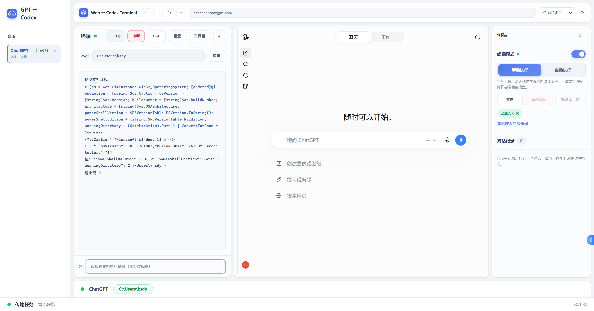
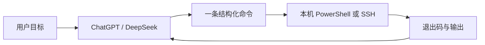
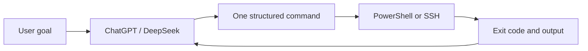

# GPT Web to Codex Terminal

[中文](#中文) · [English](#english)

## 中文

GPT Web to Codex Terminal 是一个桌面工作区：把 ChatGPT 或 DeepSeek 的对话、可持续的本机/SSH 终端，以及项目文件和 Git 信息放在同一个 Electron 窗口里。模型负责理解目标和生成命令，应用负责在选定的机器上执行命令并把结果回传到当前对话。

### 界面预览



上图展示了软件的工作区页面：左侧是会话列表，中间是终端和模型网页，右侧是执行控制、对话记录和提示词入口。ChatGPT/DeepSeek 页面需要网络和登录态，网页区域会随环境变化。

### 主要能力

| 能力 | 说明 |
| --- | --- |
| 多会话 | 为本机或不同 SSH 主机创建独立会话；会话名称、当前模型和对话地址会持久化。 |
| 双模型页面 | 在同一个会话中切换 ChatGPT 与 DeepSeek；两个页面各自保留登录态和对话。 |
| 终端循环 | 支持手动执行和自动执行。模型一次提出一条命令，应用执行后把退出码、输出和状态回传。 |
| 本机与 SSH | Windows 本机使用持久 PowerShell；SSH 使用交互终端和独立的模型命令通道。 |
| 项目工具 | 查看工作目录、Git 历史和 diff；通过工具箱访问 Git 管理、远程文件浏览、上传和下载。 |
| 设置与诊断 | 主题、ChatGPT/SSH/更新代理、发送延迟、会话导入、更新检查，以及可选的运行日志。 |

### 工作方式



每个会话只绑定一台机器。切换模型只改变前台网页，不会重置终端、SSH 连接或终端滚屏；正在执行任务时禁止切换模型，以免把结果回传到错误的对话。

### 核心技术

- **渲染层**：React 19、Vite、TypeScript；负责工作区、会话列表、终端面板和设置界面。
- **主进程**：Electron 44；管理窗口、会话生命周期、嵌入网页、命令循环、SSH、Git 和更新。
- **网页嵌入**：ChatGPT 与 DeepSeek 使用独立的 `WebContentsView` 和独立持久分区，不使用 iframe。页面适配器把 URL、会话 ID、侧栏同步和 DOM 选择器集中在 `src/shared/platforms.ts`。
- **进程边界**：renderer 只通过 `preload` 暴露的类型化 `window.api` 调用 IPC；主窗口启用 `contextIsolation`，关闭 `nodeIntegration`。
- **数据与打包**：Electron 内置 `node:sqlite` 保存会话、对话和设置；SSH 密码在系统提供加密时使用 `safeStorage`；`ssh2` 负责 SSH，`electron-builder` 负责安装包。
- **命令协议**：模型输出结构化命令，应用按会话和消息 ID 做幂等记录，再把执行结果回传，避免同一条命令重复运行。

### 项目结构

```text
src/
  main/                 Electron 主进程、嵌入网页、命令循环、SSH、Git、数据库
  preload/              contextBridge 与 window.api 类型
  shared/               IPC 类型、会话模型、平台描述和提示词
  renderer/src/         React 工作区、会话管理、终端面板和样式
tools/diag/             需要真实网页交互时使用的用户驱动诊断探针
electron.vite.config.ts 三个构建目标：main、preload、renderer
electron-builder.yml   安装包配置
```

### 安全边界与已知限制

- 每个嵌入平台使用独立的持久 cookie 分区；只允许平台声明的官方域名留在应用窗口，其他导航交给系统浏览器。
- 会话导入值只作为一次 IPC 参数写入 cookie，不写入日志或项目文件；它仍然是 bearer credential，应按密码保护。
- SSH 的交互终端和模型命令通道是两个独立连接；`cd` 等交互输入不会改变模型命令通道的工作目录。
- 当前 SSH 连接接受未知 host key，尚未提供 `known_hosts` 校验界面；不要把它当作完整的中间人防护。
- 嵌入网页依赖第三方站点的 DOM 结构和登录状态，站点改版或网络策略变化可能需要更新平台适配器。

### 许可证

MIT

---

## English

GPT Web to Codex Terminal is a desktop workspace that keeps a ChatGPT or DeepSeek conversation, a persistent local/SSH terminal, and project/Git tools in one Electron window. The model interprets the goal and proposes commands; the app runs them on the selected machine and returns the exit code, output, and status to the conversation.

### Interface preview


The image shows the workspace page with the session list on the left, the terminal and model page in the center, and execution controls, conversation history, and prompt tools on the right. The embedded ChatGPT/DeepSeek page depends on network access and login state, so that part of the window can look different on another machine.

### What it provides

| Capability | Description |
| --- | --- |
| Multiple sessions | Create independent sessions for the local machine or different SSH hosts; names, model choice, and conversation URLs persist. |
| Two embedded model sites | Switch between ChatGPT and DeepSeek inside one session. Each site keeps its own page, account, cookie jar, and conversation. |
| Terminal loop | Manual and automatic execution modes. The model proposes one command at a time; the app returns output, exit code, and execution state. |
| Local and SSH execution | A persistent PowerShell session on Windows, plus an interactive SSH terminal and a separate command channel for the model. |
| Project tools | Working-directory controls, Git history and diff, remote file browsing, uploads, downloads, and Git management. |
| Settings and diagnostics | Theme, separate ChatGPT/SSH/update proxies, send delay, session import, update checks, and opt-in runtime logs. |

### How a task flows



A session owns one machine. Switching models changes the visible web page while keeping the terminal, SSH connection, and scrollback intact. The switch is disabled during a running task so results cannot be attributed to the wrong conversation.

### Core technology

- **Renderer**: React 19, Vite, and TypeScript for the workspace shell, session manager, terminal pane, and settings.
- **Main process**: Electron 44 for window lifecycle, embedded pages, session runtime, command loop, SSH, Git, and updates.
- **Embedded pages**: ChatGPT and DeepSeek run in separate persistent `WebContentsView` instances instead of iframes. URL rules, conversation IDs, sidebar sync, and DOM selectors live in `src/shared/platforms.ts`.
- **Process boundary**: the renderer calls a typed `window.api` exposed by `preload`; the main window uses `contextIsolation` and `nodeIntegration: false`.
- **Data and packaging**: Electron's built-in `node:sqlite` stores local state, `safeStorage` protects SSH passwords when available, `ssh2` handles SSH, and `electron-builder` creates installers.
- **Command protocol**: structured commands are recorded per session and assistant message ID before execution, so one model request cannot run twice.

### Project layout

```text
src/
  main/                 Electron main process, embeds, command loop, SSH, Git, database
  preload/              contextBridge and window.api types
  shared/               IPC types, session models, platform descriptors, prompts
  renderer/src/         React workspace, session manager, terminal panels, styles
tools/diag/             User-driven probes for real webpage behavior
electron.vite.config.ts Three build targets: main, preload, renderer
electron-builder.yml   Installer configuration
```

### Security boundaries and known limits

- Each embedded platform uses a separate persistent cookie partition. Only the platform's declared official domains stay in the app window; other navigations open in the system browser.
- Imported session values are passed through one IPC call and are not written to logs or project files. They are still bearer credentials and must be protected like passwords.
- The interactive SSH terminal and the model command channel are separate connections, so typing `cd` interactively does not change the model's working directory.
- Unknown SSH host keys are currently accepted because there is no `known_hosts` UI yet; this is not full man-in-the-middle protection.
- The embedded sites depend on third-party DOM structure and login state. Site changes or network policies may require updates to the platform adapter.

### License

MIT
