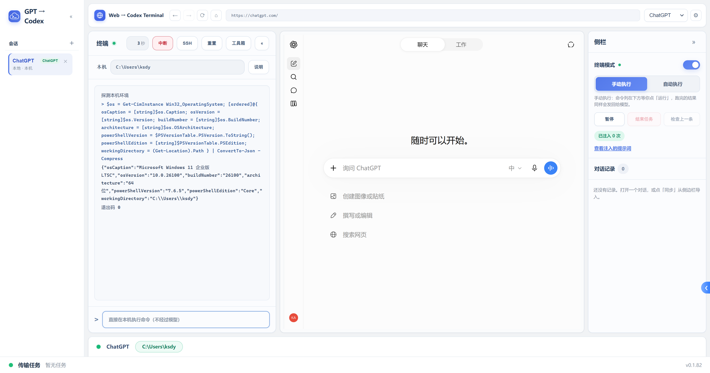
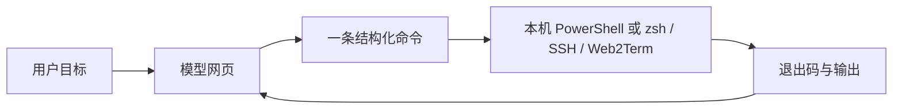
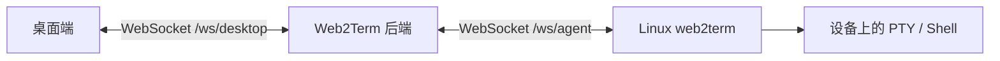
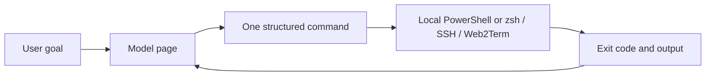
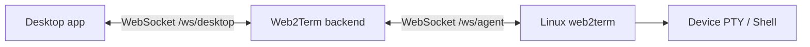

# GPT Web to Codex Terminal

[中文](#中文) · [English](#english)

## 中文

GPT Web to Codex Terminal 是一个桌面工作区：把 ChatGPT、DeepSeek、Claude 或 Gemini 的对话，本机、SSH 或 Web2Term 设备终端，以及 Git、数据库和服务控制台工具放在同一个 Electron 窗口里。模型负责理解目标和生成命令，应用负责在选定的机器上执行命令并把结果回传到当前对话。

支持 Windows 本机 PowerShell 和 macOS 本机 zsh，也可通过 SSH 或 Web2Term 连接远程机器。安装包可从 [GitHub Releases](https://github.com/naledao/gpt-web-to-codex-terminal/releases/latest) 下载。

### macOS 支持与安装

| 项目 | 当前支持 |
| --- | --- |
| 安装包 | Apple Silicon（M 系列芯片、arm64）DMG；当前发布流程未提供 Intel Mac 安装包。 |
| 本机终端 | 使用系统自带的 `/bin/zsh`，以持久的登录 Shell 执行命令；当前目录、变量和函数在同一终端会话内保留。 |
| 环境与提示词 | 自动读取 macOS 版本、架构和 Shell 信息，生成适用于 macOS / zsh 的终端提示词，并提示模型使用 BSD 工具参数、先检查 Homebrew 是否可用。 |
| 远程与工具箱 | 可使用 SSH、Web2Term、Git、MySQL、Redis 和 Nacos；数据库及控制台连接从运行应用的 Mac 发起。 |
| 更新 | 应用内检查 GitHub Release；点击下载会打开浏览器，下载 DMG 后手动覆盖安装。 |

安装步骤：

1. 下载 [Apple Silicon DMG](https://github.com/naledao/gpt-web-to-codex-terminal/releases/latest/download/GPT-Web-to-Codex-Terminal.dmg)，或在 Release 页面选择 `GPT-Web-to-Codex-Terminal-Setup-<版本号>.dmg`。
2. 打开 DMG，将 **GPT Web to Codex Terminal.app** 拖入“应用程序”目录，然后从“应用程序”打开。
3. 当前安装包使用 **ad-hoc 签名**，没有 Developer ID 签名或 Apple 公证。首次打开若提示无法验证开发者，请按 [macOS 安装说明](build/macos-installation.md) 处理；该文档也包含“已损坏，无法打开”提示的处理步骤。

使用安装包无需另装 Node.js、npm 或 PowerShell。要执行 `git`、`brew` 等外部命令，仍需在 Mac 本机安装相应工具，并确保它们在终端的 `PATH` 中。

本机 zsh 是**非交互的登录 Shell**，命令执行时标准输入为空。仅写在 `~/.zshrc` 中的交互配置不能保证被加载；额外的 `PATH` 建议放在登录配置 `~/.zprofile` 中，修改后重置终端。需要输入密码的 `sudo` 或交互式程序，应在系统“终端”中手动运行。

更新时退出应用，再将新 DMG 中的应用拖入“应用程序”并覆盖旧版本。

### 界面预览



上图展示了软件的工作区页面：左侧是会话列表，中间是终端和模型网页，右侧是执行控制、对话记录和提示词入口。模型网页需要网络和登录态，网页区域会随环境变化。

### 主要能力

| 能力 | 说明 |
| --- | --- |
| 多会话 | 为本机、SSH 主机或 Web2Term 设备创建独立会话；会话名称、当前模型、对话地址和设备绑定会持久化。 |
| 多模型页面 | 在同一个会话中切换 ChatGPT、DeepSeek、Claude 与 Gemini；各平台分别保留登录态和对话。 |
| 终端循环 | 支持手动执行和自动执行。模型一次提出一条命令，应用执行后把退出码、输出和状态回传。 |
| 三种连接方式 | 本机使用持久 Shell：Windows 为 PowerShell，macOS 为 zsh；SSH 使用交互终端和独立的模型命令通道；Web2Term 经后端连接 Linux 设备，无需设备运行 sshd。 |
| 工具箱 | Git 管理、MySQL 连接、Redis 只读浏览和嵌入式 Nacos 控制台。 |
| SSH 文件传输 | 浏览远程目录、上传和下载文件；底部统一显示各会话的传输进度，并支持取消任务。 |
| 设置与诊断 | 主题、后端地址与邮箱验证码登录、ChatGPT/SSH/更新代理、发送延迟、会话导入、更新检查，以及可选的运行日志。 |

### 工作方式


```mermaid
flowchart LR
  U[用户目标] --> C[模型网页]
  C --> J[一条结构化命令]
  J --> E[本机 PowerShell 或 zsh / SSH / Web2Term]
  E --> O[退出码与输出]
  O --> C
```

每个会话只绑定一台机器。切换模型只改变前台网页，不会重置终端、远程连接或终端滚屏；正在执行任务时禁止切换模型，以免把结果回传到错误的对话。

### Web2Term 连接

Web2Term 适合通过后端服务访问 Linux 设备。桌面端和设备端分别主动连接后端，由后端转发终端消息；设备端不需要运行 sshd。使用前需准备可访问的 Web2Term 后端，以及安装了 `web2term` 的 Linux x86_64 设备。后端必须支持设备列表查询和桌面端/设备端之间的终端消息转发。


```mermaid
flowchart LR
  D[桌面端] <-->|WebSocket /ws/desktop| B[Web2Term 后端]
  B <-->|WebSocket /ws/agent| A[Linux web2term]
  A --> T[设备上的 PTY / Shell]
```

1. 在桌面端打开 **设置 → 后端服务**，填写后端基础地址，例如 `https://example.com/backend`，点击“登录”，使用邮箱和 6 位验证码完成登录。此账号用于 Web2Term 设备管理，与模型网页的登录分别维护。
2. 在 Linux 设备上，用准备运行终端的用户依次执行以下命令，配置同一后端并登录同一账号：

   ```bash
   web2term set server
   web2term login
   web2term run
   web2term status
   ```

   后端地址在 `set server` 的交互提示中输入。`run` 启动后台进程后返回；`status` 显示“设备已在线，服务端已确认心跳”后，再到桌面端选择设备。关闭启动它的终端或 SSH 连接不会停止该后台进程；停止设备端服务使用 `web2term stop`。
3. 点击左侧会话列表的 **＋ → web2term 连接**，或在本机/SSH 终端顶部选择 **切换 → web2term**。在“我的设备”中点击“刷新设备”，查看设备名称、ID、在线/离线及禁用状态，选择在线且已启用的设备并点击“连接”。已禁用设备不能连接。
4. 应用创建或重新打开该设备的 Web2Term 会话。等待设备终端就绪后，可以手动输入命令，也可以让当前模型执行命令并接收回传结果。

后端地址需以 `http://` 或 `https://` 开头，可以包含端口和部署路径；不要填写具体 API、`/ws/desktop`、查询参数或 Token。应用会保留部署路径并自动派生 WebSocket 地址：`http://` 对应 `ws://`，`https://` 对应 `wss://`。

- **会话与数量**：每个 Web2Term 工作区使用一个独立 PTY，手动输入和模型命令共用该工作区的 Shell。每台设备最多同时运行 3 个终端，创建中和关闭中的终端也计入上限。
- **切换设备**：桌面端当前只维护一条 Web2Term 后端连接。同一设备的多个会话共用连接；选择另一台设备会替换连接，使原设备的终端断开。切换模型网页不会更换设备。
- **重置与关闭**：“重置”或“重新连接”会重新创建终端 Shell；“关闭”只关闭当前终端，保留会话、对话记录和设备绑定。最后一个终端关闭后释放后端连接，之后可点击“重新连接”继续使用。
- **断线与登录**：断线后需重新创建终端，原 Shell 状态不会恢复。设备端后台进程会对可恢复的网络故障尝试重连；桌面端通过“重新连接”恢复。更换后端、账号或登录凭据会断开当前桌面端连接；重新打开已有设备会话需登录创建它时的后端和账号。设备端更新地址或凭据后需先 `web2term stop`，再 `web2term run`。
- **文件能力**：Web2Term 当前支持终端命令，尚未接入远程文件浏览、上传、下载、`read_files` 和 Git 面板。读取文件或操作 Git 可以在设备终端中执行相应命令。

设备未出现时，先确认两端使用相同后端和账号，并用 `web2term status` 检查设备端状态；仅看到 `run` 启动成功还不能证明设备在线。登录过期需重新登录；提示设备已被占用时，应先断开已有客户端再连接。桌面端登录与连接诊断日志位于系统临时目录下的 `gpt-login-diag/`：Windows 为 `%TEMP%/gpt-login-diag/`，macOS 通常为 `$TMPDIR/gpt-login-diag/`（未设置 `TMPDIR` 时通常为 `/tmp/gpt-login-diag/`）；连接错误界面会显示具体日志路径。设备端日志路径可通过 `web2term status` 查看。

设备端安装、构建和详细说明见 [web2term Linux 工具](agents/linux/README.md)，消息格式见 [终端协议 v1](agents/linux/docs/terminal_protocol.md)。

### 工具箱

在展开的终端面板顶部点击 **工具箱**，可打开以下工具：

| 工具 | 当前功能 |
| --- | --- |
| Git 管理 | 查看当前分支、提交记录、文件改动和增删行数；按目录或改动类型浏览文件，使用统一或并排视图查看 diff。面板用于只读查看，提交、切分支等操作通过终端执行。 |
| MySQL 连接 | 保存多个连接并用标签页打开；选择数据库，搜索表名或表注释，查看表/视图数据、字段注释和建表 DDL。数据预览最多显示 200 行，并展示实际执行的 SQL；支持按主键删除记录，以及在表标签页内编写并执行单条 SQL。 |
| Redis 连接 | 保存多个单机 Redis 连接，支持用户名、密码、DB 编号及 TLS，提供测试连接、键名搜索、分批加载和 TTL 查看；支持 String、Hash、List、Set、ZSet、Stream 数据的只读浏览。 |
| Nacos 连接 | 保存多个控制台地址、名称及可选命名空间，在标签页中打开实际 Nacos 网页；提供地址栏、后退、前进、刷新和停止加载。登录及控制台操作由 Nacos 网页提供。 |

MySQL、Redis 和 Nacos 的连接配置保存在本机，并按当前工作环境区分；MySQL/Redis 密码使用系统加密保存。**这些工具的网络请求从桌面端发出，不经过 SSH 隧道或 Web2Term 设备。** 因此，即使当前会话连接远程机器，填写 `127.0.0.1` 仍指向运行桌面应用的电脑，需要填写桌面端可访问的服务地址。

Git 面板当前读取桌面端本机目录，SSH 远端仓库需在 SSH 终端中操作；Web2Term 会话禁用 Git 面板。SSH 的“文件”和“上传”入口位于终端目录栏，传输任务集中显示在窗口底部。Nacos 使用独立持久网页分区保留登录态，与模型网页账号分开。

### 源码开发与构建

开发环境建议使用 Node.js 22 和 npm，与发布工作流保持一致。在项目根目录安装依赖并启动：

```bash
npm ci
npm run dev
```

| 命令 | 用途 |
| --- | --- |
| `npm run dev` | 启动 Vite 开发服务器和 Electron，支持热更新。 |
| `npm run build` | 执行类型检查并构建主进程、preload 和渲染层，输出到 `out/`。 |
| `npm run dist:mac` | 在 macOS 上构建 Apple Silicon DMG，安装包输出到 `release/`。 |
| `npm run dist:win` | 构建 Windows x64 安装包，输出到 `release/`。 |
| `npm run test:mac` | 在 Mac 上运行本机终端回归测试，不启动 Electron 或访问模型网站。 |

Mac 打包后，应用目录为 `release/mac-arm64/GPT Web to Codex Terminal.app`，DMG 文件名为 `GPT-Web-to-Codex-Terminal-Setup-<版本号>.dmg`。当前打包配置使用 ad-hoc 签名，无需 Developer ID 证书，也不执行 Apple 公证。构建通过不代表真实网页登录或完整工作流程已经测试通过；这些行为需在目标 Mac 上实际测试。

### 核心技术

- **渲染层**：React 19、Vite、TypeScript；负责工作区、会话列表、终端面板和设置界面。
- **主进程**：Electron 44；管理窗口、会话生命周期、嵌入网页、命令循环、SSH、Web2Term、工具箱和更新。
- **网页嵌入**：各模型平台及 Nacos 控制台使用独立的 `WebContentsView` 和持久分区，不使用 iframe。模型页面适配器把 URL、会话 ID、侧栏同步和 DOM 选择器集中在 `src/shared/platforms.ts`。
- **进程边界**：renderer 只通过 `preload` 暴露的类型化 `window.api` 调用 IPC；主窗口启用 `contextIsolation`，关闭 `nodeIntegration`。
- **数据与连接**：Electron 内置 `node:sqlite` 保存会话、对话、连接配置和设置；系统加密通过 `safeStorage` 提供；`ssh2`、`ws`、`mysql2` 和 `ioredis` 分别负责 SSH、Web2Term、MySQL 与 Redis，`electron-builder` 负责安装包。
- **命令协议**：模型输出结构化命令，应用按会话和消息 ID 做幂等记录，再把执行结果回传，避免同一条命令重复运行。

### 项目结构

```text
src/
  main/                 Electron 主进程、命令循环、SSH/Web2Term、Git、数据库、Nacos
  preload/              contextBridge 与 window.api 类型
  shared/               IPC 类型、会话模型、平台描述和提示词
  renderer/src/         React 工作区、会话管理、终端面板和样式
agents/linux/           Go 编写的 web2term Linux 设备端及终端协议文档
tools/diag/             需要真实网页交互时使用的用户驱动诊断探针
electron.vite.config.ts 三个构建目标：main、preload、renderer
electron-builder.yml   安装包配置
```

### 安全边界与已知限制

- 每个嵌入平台使用独立的持久 cookie 分区；页面自身的导航**不再限制域名**（放行 Cloudflare 校验所必需），但页面请求打开新窗口的链接仍交给系统浏览器。
- 会话导入值只作为一次 IPC 参数写入 cookie，不写入日志或项目文件；它仍然是 bearer credential，应按密码保护。
- SSH 的交互终端和模型命令通道使用两个独立 Shell；应用会尝试根据交互终端提示符同步目录，但环境变量、交互程序状态不共享。Web2Term 的手动输入与模型命令则使用同一工作区 Shell。
- Web2Term 终端以运行设备端工具的 Linux 用户权限执行命令；后端负责客户端认证、设备归属校验和终端消息路由。设备在线或 WebSocket 已连接不等于终端已就绪。
- 当前 SSH 连接接受未知 host key，尚未提供 `known_hosts` 校验界面；不要把它当作完整的中间人防护。
- 嵌入网页依赖第三方站点的 DOM 结构和登录状态，站点改版或网络策略变化可能需要更新平台适配器。

### 许可证

MIT

---

## English

GPT Web to Codex Terminal is a desktop workspace that keeps a ChatGPT, DeepSeek, Claude, or Gemini conversation, a local, SSH, or Web2Term device terminal, and Git, database, and service-console tools in one Electron window. The model interprets the goal and proposes commands; the app runs them on the selected machine and returns the exit code, output, and status to the conversation.

Local terminals use PowerShell on Windows and zsh on macOS. SSH and Web2Term connect to remote machines. Download installers from [GitHub Releases](https://github.com/naledao/gpt-web-to-codex-terminal/releases/latest).

### macOS support and installation

| Item | Current support |
| --- | --- |
| Installer | An Apple Silicon (M-series, arm64) DMG. The current release workflow does not provide an Intel Mac installer. |
| Local terminal | The system `/bin/zsh` runs as a persistent login Shell. The working directory, variables, and functions survive commands within the same terminal session. |
| Environment and prompts | Detects the macOS version, architecture, and Shell, then builds a macOS / zsh terminal prompt that directs the model to use BSD tool options and check Homebrew availability first. |
| Remote connections and toolbox | SSH, Web2Term, Git, MySQL, Redis, and Nacos are available. Database and console connections originate from the Mac running the app. |
| Updates | Checks GitHub Releases in the app. Download opens the browser; install the downloaded DMG by replacing the existing app manually. |

Installation:

1. Download the [Apple Silicon DMG](https://github.com/naledao/gpt-web-to-codex-terminal/releases/latest/download/GPT-Web-to-Codex-Terminal.dmg), or select `GPT-Web-to-Codex-Terminal-Setup-<version>.dmg` on the Release page.
2. Open the DMG, drag **GPT Web to Codex Terminal.app** into **Applications**, and open it from there.
3. The installer is **ad-hoc signed**, without a Developer ID certificate or Apple notarization. If macOS cannot verify the developer, follow the [macOS installation guide](build/macos-installation.md), which also covers the “app is damaged” message.

The packaged app does not require a separate Node.js, npm, or PowerShell installation. External commands such as `git` and `brew` still need their corresponding tools installed on the Mac and available on the terminal's `PATH`.

Local zsh is a **non-interactive login Shell**, and command execution receives empty standard input. Interactive configuration in `~/.zshrc` is not guaranteed to load; put additional `PATH` configuration in the login profile `~/.zprofile` and reset the terminal after changes. Run password-prompting `sudo` commands and interactive programs manually in the system Terminal.

To update, quit the app, then drag the new copy from the DMG into Applications and replace the old version.

### Interface preview


The image shows the workspace page with the session list on the left, the terminal and model page in the center, and execution controls, conversation history, and prompt tools on the right. The embedded model page depends on network access and login state, so that part of the window can look different on another machine.

### What it provides

| Capability | Description |
| --- | --- |
| Multiple sessions | Create independent sessions for the local machine, SSH hosts, or Web2Term devices; names, model choice, conversation URLs, and device bindings persist. |
| Multiple model sites | Switch between ChatGPT, DeepSeek, Claude, and Gemini inside one session. Each site keeps its own page, account, cookie jar, and conversation. |
| Terminal loop | Manual and automatic execution modes. The model proposes one command at a time; the app returns output, exit code, and execution state. |
| Three connection methods | A persistent local Shell: PowerShell on Windows or zsh on macOS; an interactive SSH terminal and a separate model command channel; or a Linux device terminal relayed through the Web2Term backend without a device-side sshd. |
| Toolbox | Git inspection, MySQL connections, a read-only Redis browser, and an embedded Nacos console. |
| SSH file transfers | Remote directory browsing, uploads, downloads, and a shared transfer bar with progress and cancellation across sessions. |
| Settings and diagnostics | Theme, backend address and email-code login, separate ChatGPT/SSH/update proxies, send delay, session import, update checks, and opt-in runtime logs. |

### How a task flows


```mermaid
flowchart LR
  U[User goal] --> C[Model page]
  C --> J[One structured command]
  J --> E[Local PowerShell or zsh / SSH / Web2Term]
  E --> O[Exit code and output]
  O --> C
```

A session owns one machine. Switching models changes the visible web page while keeping the terminal, remote connection, and scrollback intact. The switch is disabled during a running task so results cannot be attributed to the wrong conversation.

### Web2Term connections

Web2Term connects to Linux devices through a backend service. Both the desktop app and the device agent initiate connections to that backend, which relays terminal messages; the device does not need sshd. You need a reachable Web2Term backend and a Linux x86_64 device with `web2term` installed. The backend must support device-list queries and terminal-message forwarding between desktop clients and agents.


```mermaid
flowchart LR
  D[Desktop app] <-->|WebSocket /ws/desktop| B[Web2Term backend]
  B <-->|WebSocket /ws/agent| A[Linux web2term]
  A --> T[Device PTY / Shell]
```

1. Open **设置 → 后端服务** (Settings → Backend service) in the desktop app. Enter the backend base address, such as `https://example.com/backend`, click “登录” (Log in), and sign in with your email and a six-digit code. This account manages Web2Term devices and is separate from model-site accounts.
2. On the Linux device, run these commands as the user whose permissions the remote terminal should use. Configure the same backend and sign in to the same account:

   ```bash
   web2term set server
   web2term login
   web2term run
   web2term status
   ```

   Enter the address at the interactive `set server` prompt. `run` starts a background process and returns. Wait for `status` to report that the device is online and its heartbeat has been acknowledged before selecting it in the desktop app. Closing the initiating terminal or SSH connection leaves the agent running; use `web2term stop` to stop it.
3. Choose **＋ → web2term 连接** (Web2Term connection) in the session list, or **切换 → web2term** (Switch → Web2Term) at the top of a local/SSH terminal. In “我的设备” (My devices), use “刷新设备” (Refresh devices) to see device names, IDs, online/offline states, and disabled status. Select an online, enabled device and click “连接” (Connect). Disabled devices cannot be connected.
4. The app creates or reopens a Web2Term session for that device. Once the device terminal is ready, type commands manually or let the current model execute commands and receive their results.

The backend address must start with `http://` or `https://` and may include a port and deployment path. Do not append an API endpoint, `/ws/desktop`, query parameters, or a token. The app preserves the deployment path and derives the WebSocket address automatically: `http://` becomes `ws://`, and `https://` becomes `wss://`.

- **Sessions and limits**: each Web2Term workspace owns an independent PTY, with manual input and model commands sharing that workspace's Shell. Each device supports up to three concurrent terminals, including terminals being opened or closed.
- **Device switching**: the desktop app currently maintains one Web2Term backend connection. Sessions on the same device share it; selecting another device replaces that connection and disconnects the previous device's terminals. Switching model pages keeps the device binding.
- **Reset and close**: “重置” (Reset) or “重新连接” (Reconnect) creates a new terminal Shell. “关闭” (Close) closes the current terminal while retaining its workspace, transcript, and device binding. Closing the last terminal releases the backend connection; Reconnect can open a terminal again later.
- **Disconnections and login**: disconnected terminals must be recreated, and their previous Shell state is not restored. A running device agent retries recoverable network failures; use Reconnect on the desktop app. Changing the backend, account, or login credentials disconnects the desktop connection. Existing device sessions require the backend and account used to create them. After changing the agent's address or credentials, run `web2term stop`, then `web2term run`.
- **File features**: Web2Term currently supports terminal commands. Remote file browsing, upload/download, `read_files`, and the Git panel are not connected to this transport yet. Use commands in the device terminal to read files or work with Git.

If a device is missing, confirm that both ends use the same backend and account, then inspect `web2term status`; a successful `run` launch alone does not prove the device is online. Sign in again after login expiry. If the device is occupied, disconnect the existing client before retrying. Desktop login and connection diagnostic logs are in the system temporary directory under `gpt-login-diag/`: `%TEMP%/gpt-login-diag/` on Windows, usually `$TMPDIR/gpt-login-diag/` on macOS (typically `/tmp/gpt-login-diag/` if `TMPDIR` is unset). Connection error views show the actual log path. `web2term status` displays device-side log paths.

See the [web2term Linux agent guide](agents/linux/README.md) for installation and build instructions, and [Terminal protocol v1](agents/linux/docs/terminal_protocol.md) for message formats.

### Toolbox

Click **工具箱** (Toolbox) at the top of the expanded terminal panel to open these tools:

| Tool | Current functionality |
| --- | --- |
| Git management | Inspect the current branch, commit history, changed files, and added/deleted line counts. Browse by directory or change type and view unified or side-by-side diffs. The panel is read-only; use the terminal for commits, branch changes, and other writes. |
| MySQL connections | Save multiple connections and open them in tabs. Select a database, search table names/comments, preview table/view data and column comments, and inspect CREATE TABLE DDL. Data previews display up to 200 rows and the SQL used to fetch them. Delete records by primary key, or write and execute a single SQL statement inside a table tab. |
| Redis connections | Save multiple standalone Redis connections with username, password, DB index, and TLS options. Test connections, search keys, load additional batches, inspect TTLs, and browse String, Hash, List, Set, ZSet, and Stream values in read-only mode. |
| Nacos connections | Save multiple console addresses, names, and optional namespaces; open the actual Nacos site in a console tab with an address bar, back/forward navigation, refresh, and stop-loading controls. Authentication and console actions are provided by the Nacos site itself. |

MySQL, Redis, and Nacos connection profiles are stored locally and grouped by the current work environment; MySQL/Redis passwords use system encryption. **These tools make network requests from the desktop app, without an SSH tunnel or Web2Term relay.** Even in a remote session, `127.0.0.1` refers to the computer running the desktop app, so use an address reachable from that computer.

The Git panel currently reads directories on the desktop computer. Use the SSH terminal for remote repositories; the Git panel is disabled in Web2Term sessions. SSH file browsing and upload buttons are in the terminal's directory bar, with transfers listed at the bottom of the window. Nacos retains login state in a separate persistent web partition, apart from model-site accounts.

### Development and builds

Use Node.js 22 and npm to match the release workflow. From the project root, install dependencies and start the development app:

```bash
npm ci
npm run dev
```

| Command | Purpose |
| --- | --- |
| `npm run dev` | Starts the Vite development server and Electron with hot reload. |
| `npm run build` | Typechecks and builds the main process, preload, and renderer into `out/`. |
| `npm run dist:mac` | Builds an Apple Silicon DMG on macOS and writes the installer to `release/`. |
| `npm run dist:win` | Builds a Windows x64 installer in `release/`. |
| `npm run test:mac` | Runs local terminal regression tests on a Mac without starting Electron or accessing model websites. |

Mac packaging produces `release/mac-arm64/GPT Web to Codex Terminal.app` and `GPT-Web-to-Codex-Terminal-Setup-<version>.dmg`. The current configuration uses ad-hoc signing without a Developer ID certificate or Apple notarization. A successful build does not verify real website login or the complete workflow; test those on the target Mac.

### Core technology

- **Renderer**: React 19, Vite, and TypeScript for the workspace shell, session manager, terminal pane, and settings.
- **Main process**: Electron 44 for window lifecycle, embedded pages, session runtime, command loop, SSH, Web2Term, toolbox services, and updates.
- **Embedded pages**: model sites and the Nacos console run in separate `WebContentsView` instances with persistent partitions instead of iframes. Model URL rules, conversation IDs, sidebar sync, and DOM selectors live in `src/shared/platforms.ts`.
- **Process boundary**: the renderer calls a typed `window.api` exposed by `preload`; the main window uses `contextIsolation` and `nodeIntegration: false`.
- **Data and connections**: Electron's built-in `node:sqlite` stores sessions, conversations, connection profiles, and settings; `safeStorage` provides system encryption. `ssh2`, `ws`, `mysql2`, and `ioredis` handle SSH, Web2Term, MySQL, and Redis respectively, while `electron-builder` creates installers.
- **Command protocol**: structured commands are recorded per session and assistant message ID before execution, so one model request cannot run twice.

### Project layout

```text
src/
  main/                 Electron main process, command loop, SSH/Web2Term, Git, database, Nacos
  preload/              contextBridge and window.api types
  shared/               IPC types, session models, platform descriptors, prompts
  renderer/src/         React workspace, session manager, terminal panels, styles
agents/linux/           Go web2term Linux agent and terminal protocol documentation
tools/diag/             User-driven probes for real webpage behavior
electron.vite.config.ts Three build targets: main, preload, renderer
electron-builder.yml   Installer configuration
```

### Security boundaries and known limits

- Each embedded platform uses a separate persistent cookie partition. Navigation the page performs **is no longer restricted by domain** (required for Cloudflare's challenge to complete); links the page asks to open in a new window still go to the system browser.
- Imported session values are passed through one IPC call and are not written to logs or project files. They are still bearer credentials and must be protected like passwords.
- The interactive SSH terminal and the model command channel use separate Shells. The app attempts to synchronize directories from the interactive prompt, but environment variables and interactive program state are not shared. Web2Term manual input and model commands use the same workspace Shell.
- Web2Term commands run with the permissions of the Linux user running the agent. The backend handles client authentication, device ownership checks, and terminal routing. An online device or an open WebSocket does not by itself mean the terminal is ready.
- Unknown SSH host keys are currently accepted because there is no `known_hosts` UI yet; this is not full man-in-the-middle protection.
- The embedded sites depend on third-party DOM structure and login state. Site changes or network policies may require updates to the platform adapter.

### License

MIT
